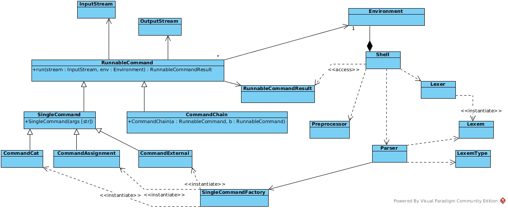

Architecture of Command-Line Interface prototype
================================================

Class diagram (created with ``Visual Paradigm``):

| The main class is :class:`cli.shell.Shell`.  
| It prompts user for an input, then passes it to a :class:`cli.preprocessor.Preprocessor`.  
| Then, the preprocessed string goes to :class:`cli.lexer.Lexer`.  
| After that, lexems are parsed by :class:`cli.parser.Parser`.  
| These three steps are clearly separated and are testable by themselves.
|
| Parser makes a :class:`cli.commands.RunnableCommand` out of stream of lexems.
| :class:`cli.commands.RunnableCommand` represents a command (in broad sense), so
| that ``echo``, ``wc``, assignment and others, as well as pipes have
| their respective class counterparts. The former must inherit from :class:`cli.commands.SingleCommand`,
| the latter - from :class:`cli.commands.CommandChain`.
|
| Commands run in an environment. It is represented by :class:`cli.environment.Environment`.
| Commands read from :class:`cli.streams.InputStream`-s and write to :class:`cli.streams.OutputStream`.
| When a pipe is processed, the first command's OutputStream is converted to the second command's InputStream.
|
| RunnableCommand provides a simple interface to run a command, given 
| :class:`cli.streams.InputStream` and :class:`cli.environment.Environment`. The returned
| value is :class:`cli.commands.RunnableCommandResult`, which is an abstraction on return value.
|
| Each command (like ``echo`` and ``exit``) is implemented as a separate class
| in :mod:`cli.commands` or :mod:`cli.single_command`. This allows easy extension.
| On the other hand, commands do not know about each other, so they need to implement
| their argument parsing by themselves.
|
| Commands interact with each other using return codes. One exception from this rule
| is ``exit`` command - it throws :exc:`cli.exceptions.ExitException` on run,
| so that shell can exit immediately.
